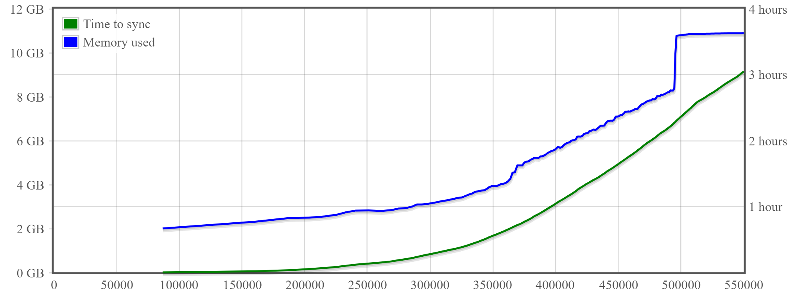

# About Gocoin

**Gocoin** is a full **Bitcoin** solution written in Go language (golang).

The software architecture is focused on maximum performance of the node
and cold storage security of the wallet.

The **wallet** is designed to be used offline.
It is deterministic and password seeded.
As long as you remember the password, you do not need any backups ever.
Wallet can be used without the client, but with the provided **balio** tool instead.

The **client** (p2p node) is an application independent from the **wallet**.
It keeps the entire UTXO set in RAM, providing the best block processing performance on the market.

System memory and time needed to sync BTC block chain up to the given block number:

*The data above is from Gocoin 1.9.5 running on [Google Cloud Platform](https://cloud.google.com/) VPS with 32 vCPUs and SSD persistent storage. 
For results from other platforms see [gocoin.pl](https://gocoin.pl/gocoin_performance.html) website.*

# Requirements

## Hardware

**client**:

* 64-bit architecture OS and Go compiler.
* File system supporting files larger than 4GB.
* At least 20GB of system RAM, with 32GB being a recommended future-proof amount.

**wallet**:

* Any platform that you can make your Go (cross)compiler to build for (Raspberry Pi works).
* For security reasons make sure to use encrypted swap file (if there is a swap file).
* If you decide to store your password in a file, have the disk encrypted (in case it gets stolen).

## Operating System
Having hardware requirements met, any target OS supported by your Go compiler will do.
Currently that can be at least one of the following:

* Windows
* Linux
* OS X
* Free BSD

## Build environment
In order to build Gocoin yourself, you will need the following tools installed in your system:

* **Go** (version 1.8 or higher) - http://golang.org/doc/install
* **Git** - http://git-scm.com/downloads

If the tools mentioned above are all properly installed, you should be able to execute `go` and `git`
from your OS's command prompt without a need to specify full path to the executables.

# Getting sources

Use `go get` to fetch and install the source code files.

	go get github.com/piotrnar/gocoin

Note that the source files are stored inside your GOPATH folder.
To find out where the GOPATH folder is, execute:

	go env GOPATH

# Building

## Client node
Go to the `client/` folder and execute `go build` there.

## Wallet
Go to the `wallet/` folder and execute `go build` there.

## Tools
Go to the `tools/` folder and execute:

	go build btcversig.go

Repeat the `go build` for each source file of the tool you want to build.

# Binaries

Windows or Linux (amd64) binaries can be downloaded from

 * https://sourceforge.net/projects/gocoin/files/?source=directory

Please note that the binaries are usually not up to date.
I strongly encourage everyone to build the binaries himself.

# Development
Although it is an open source project, I am sorry to inform you that **I will not merge in any pull requests**.
The reason is that I want to stay an explicit author of this software, to keep a full control over its
licensing. If you are missing some functionality, just describe me your needs and I will see what I can do
for you. But if you want your specific code in, please fork and develop your own repo.

# Support
The official web page of the project is served at <a href="http://gocoin.pl">gocoin.pl</a>
where you can find extended documentation, including **User Manual**.

Please do not log github issues when you only have questions concerning this software.
Instead see [Contact](http://gocoin.pl/gocoin_links.html) page at [gocoin.pl](http://gocoin.pl) website
for possible ways of contacting me.
